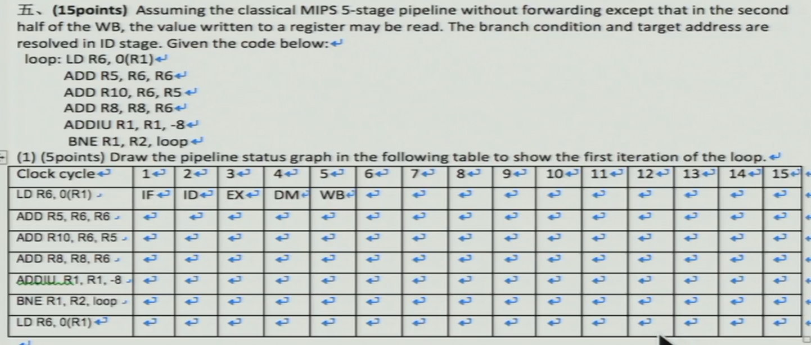
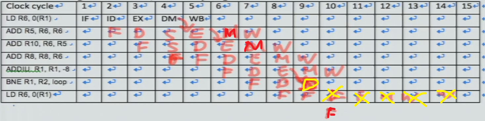
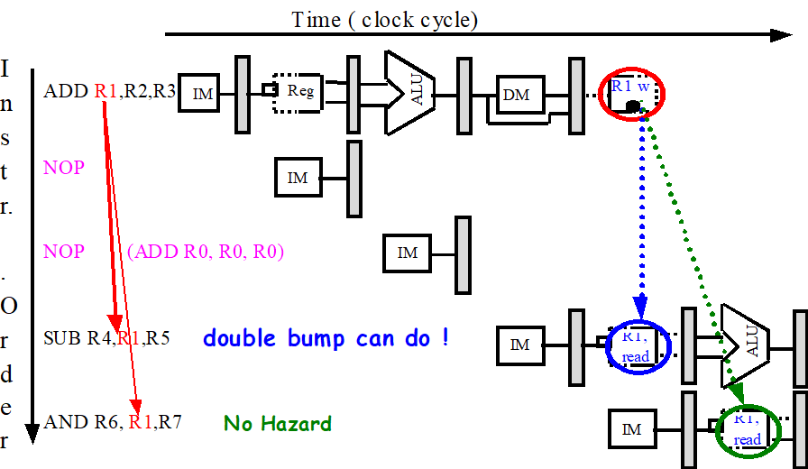
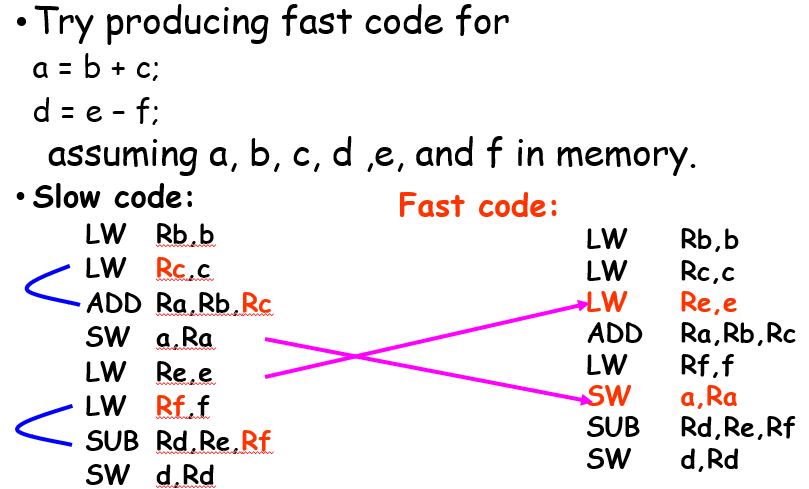

## ch3 practice

- C

- A

- D

- D

- A

- 不能用forward解决的：
  - load之后紧跟着alu，或跟着store（store用的是load得到的地址）
  - 跳转之前（跳转在ID阶段）
    - 跳转判断需要上一条语句的结果
  - A

- D
  - **Pipeline interlock**：做stall的一种手段
  - Splitting Cache：把指令和数据分为两个（结构冲突）

- D
  - A. 按照指令顺序发射，乱序执行
  - D. aggravate 恶化 要恶化也是反过来：结构冲突恶化数据冲突

------

------

|      | I1   | I2   | I3   | I4   | I5   |
| ---- | ---- | ---- | ---- | ---- | ---- |
| I1   |      |      |      |      |      |
| I2   | X    |      |      |      |      |
| I3   | WAW  | RAW  |      |      |      |
| I4   | X    | WAW  |      |      |      |
| I5   | RAW  | RAW  | RAW  | RAW  |      |
| I6   | X    | X    | X    | X    | WAW  |

------

------

- No, SrcA2
- Yes, SrcA3
- Yes, SrcB3
- No, SrcB1

------

------

-  （2）添加延时槽
- 

------

- 不行，因为没有做减1的部件，否则ALU既要做减1又要做地址计算
- 

## ch3

- CPI: **clock cycle per instruction**

  - 单周期：CPI = 1，但时钟周期长
  - 流水线：CPI = 1，但时钟周期可以是单周期的五分之一
  - 多周期：CPI = 5

- 

- 什么指令没有rs？

  - j, jal

- 什么指令以rt为源寄存器

  - ALU, Beq, Bne, SW

- speedup:

  

  - 单周期实现与流水线对比
    - 原本的CPI为：1
    - 流水线的CPI为：1+每条指令的stall周期数
    - 时钟周期数减少：与流水线深度有关
    - 

### Structure Hazard

- 结构竞争：改变硬件资源来解决

  - 增加memory和寄存器的访问口

  - Not fully pipelined functional units

    - 可以通过把它完全流水化解决
    - 或用多个functional units

    

- double bump 双重触发

  

  - allow WRITE-then-READ in one clock cycle

- 为什么允许结构竞争存在

  - 减少成本
    - 带宽需要增加
    - fully pipelined floating point units costs lots of gates
  - 为了减少功能单元的延迟
    - 为了使功能单元流水化，我们需要加入延时
    - 未流水化的版本每次操作需要的时钟周期数可能会少
    - 还有其他好处，以后会看到

- 结构竞争与功能单元

  

  

### Data Hazard

#### Forwarding

------

------

- 对于WB阶段，有两种情况：ALU的输出或是读取到的存储器的值

  - 这两种值要写回寄存器组

- 还有一种情况：LW后是SW

  

  - lw：rt <- memory[base+offset]
  - sw：memory[base+offset] <- rt

  - 上下两条指令的rt是一样的话，可以用forwarding
  - LW: IF ID EX DM WB
  - SW:     IF  ID  EX  DM  WB
  - 注意到Data Memory左边接口：上面是addr，下面是din
  - MEM/WB.LMD -> DM input
  - 

- Forwarding并不一定一直可行

  - 理解成ALU计算需要一个周期；DM read + alu计算两个操作的时长超过了一个周期
  - 基于pipeline的假设，每个stage分配完成之后，给定的时钟周期里就只保证支持那个stage里的操作
  - 载入指令的MEM周期生成一个值，ADD的EXE会需要它，而它们是同时发生的

  

- Example

  - without forwarding
  
    
    
  - with forwarding
  
    
  
- 编译器可以重排指令以避免load stall

  

### Control Hazard

- 四种简单的方法

  - Freeze or flush the pipeline
  - Predict-not-taken
  - Predict-taken
  - Delayed branch

- 插入stall

  - 需要 ID EXE MEM 才能得到跳转的地址

  

- Flushing the pipeline

  - Holding or deleting any instruction after branch until the branch destination is know.
  - Penalty is fixed.
  - Can not be reduced by software.

- Branch Not Taken

  - 如果Branch taken了，就把三条错误的指令kill掉
  - 因为还没有写回，且MEM刚进行，可以kill

  

  - 

- Branch Taken

  - 在ID阶段结束可以获得Branch后的PC地址

    

  - 因此可以比较taken和not taken

    - 预测taken的情况下，如果taken了，也还是需要stall一个周期

      

    

- 把Branch计算提前到ID的数据通路

  

  - 这一个周期在MIPS称为：**the branch delay slot**

    

  - 改进后，对Flushing来说，只需要插入一个stall就可以解决control hazard了

- Delayed Branch

  - 利用branch delay slot，改进后是一个周期

  - 编译器reorder一下

    - a）回头看：ADD指令不管taken还是not taken都要执行，就放到延时槽
    - b）循环体：大概率taken，taken的分支放到延时槽
      - 跳出循环的时候还需要考虑R4影不影响后续
      - 一般需要复制目标指令，因为其他路径也可能会到达这一目标指令
      - 或理解为第一次迭代会出错
    - c）not taken分支挑一条指令

    

  - 副作用：编译很讨厌；中断异常复杂；软硬件要一致

  - 情况a

    - 注意branch的offset会改变

    

  - 情况b

    - 

    - 为什么选SW？

      - SW没有目的寄存器，不用判断死不死
      - 执行次数和循环次数是一致的，不像上面那个
      - 注意R1前面sub了一下，所以SW这需要+4偏移量

      

    

  - 延时槽可能不止一条指令，编译器就更难找这些指令了

- Performance

  

  

  

  

- 总结

  - 比如说MIPS R4000，三拍之后才知道跳转的地址，四拍之后才知道跳还是不跳
  - In general, the deeper the pipeline, the worse the branch penalty in clock cycles.
    - 流水线深度越大，条件转移判断和地址判断越往后，控制竞争带来延时就越严重

- 转移预测器 Branch prediction

  - static branch prediction

    - 由编译器决定哪个分支可能被CPU命中
    - 依赖编译时可用信息的低成本静态机制
    - 利用先前运行过程收集的一览数据，从而尝试预测分支是否会跳转

  - dynamic branch prediction **用硬件做的**

    - 根据程序特性对分支进行动态预测的策略
    - 1位分支预测器，2位，N位
    - Correlating Branch Prediction

  - 1-bit branch predictior

    - 理想的情况：程序中每一条转移指令都对应着这么一个bit，**来记录上次是否是跳转**
    - 但是比如说程序有20M，那么转移指令也会有很多，不可能每条指令都对应
    - 那么我们可以取低10位做索引，匹配的所有对应的转移指令都对应同一个bit
    - Branch History Table: Lower bits of PC address index table of 1-bit values

    

  - 2-bit branch-prediction buffer

    - 要对股票有一定的信心：一位预测器只要变就修改预测方向
    - 2位：预测出错两次之后才改变预测方向

    

    - 通常：4096个entry，2位预测器

  - Correlating Branch Prediction 相关转移预测器

    - 转移指令的行为不止和本身这条指令有关系，还和邻近的指令有关系
      - 由刚执行过的N条跳转指令的跳转情况来决定的
    - The primary motivation for correlating branch predictors came from the observation
      that the standard 2-bit predictor using only local information failed on some
      important branches and that, by adding global information, the performance
      could be improved.
    - 下面图的意思是说，对于每个分支指令，通过它地址的低4位找到属于它的那一行。现在我全局记录的是前两条分支指令的branch taken情况。找到属于它的那行后，我根据现在全局记录的情况找到这个情况所对应的2位转移预测器。根据这个2位转移预测器，得到我的预测。随后再根据它是否符合预测改变这个2位转移预测器
    
    
    

### Extend 5-stage Pipeline To Multiple-cycle operations

- 两个名词
  - **Latency**: the number of intervening cycles between an instruction that produces a result and an instruction that uses the result.
    - 注意点：intervening指的是介于其中的
  - **Initiation interval**: the number of cycles that must elapse between instructions issue to the same unit.
    - 对于full pipelined units，为1
    - 对于unpipelined units，为 latency + 1

  

- 指令完成是乱序的

  - 这里是double的lw，实现的是64位宽的接口

  

- **FP寄存器写端口结构冲突**

  

  - 写口的稳定端口数为1，因此增加写口不好

  - 检测和插入stall，使得WB串行化

    - 在ID阶段检测写口是否写，在发射之前stall掉
      - 增加一个shift register和相应的写冲突逻辑
        - 移位寄存器记录已经发射的指令是否要写，同时每个周期右移
      - 可能恶化数据冲突

    - 当指令想进入**MEM或WB**时stall掉
      - 在此时检测冲突会比较容易
      - 流水线控制变难，因为stall会在两个地方发生

- 数据冲突类型

  - RAW true dependence

  - WAW output dependence

    - 后面指令执行的结果会被前面指令执行的结果所覆盖掉

  - WAR anti-dependence

    - 目前还不会出问题，在后面会有种算法会出现WAR问题

    - WAR *(write after read)*—*j* tries to write a destination before it is read by *i*, so

      *i* incorrectly gets the *new* value. This hazard arises from an antidependence.

      WAR hazards cannot occur in most static issue pipelines—even deeper pipelines

      or floating-point pipelines—because all reads are early (in ID) and all

      writes are late (in WB). (See Appendix A to convince yourself.) **A WAR hazard**

      **occurs either when there are some instructions that write results early in**

      **the instruction pipeline *and* other instructions that read a source late in the**

      **pipeline, or when instructions are reordered, as we will see in this chapter.**

- RAW引起的stall

  - 注意ID和stall的顺序：含义是，ID译码后，发现得不到数据后再stall

  

- WAW hazard

  - 第一个stall是因为WB写口结构冲突，可以在ID识别，或在其想进入MEM或WB时stall掉
  - 第二个stall是结构冲突
  - 两个WB构成WAW冲突

  

- 解决WAW hazard

  - 延迟LD指令的发射，直到ADDD进入MEM
  - 取消先前指令的WB阶段，上图即废除ADDD的结果

- Checks required in ID

  - 检查结构冲突：写端口和功能单元
  - RAW hazards：可以看上面的例子
  - WAW hazards：判断A1, ..., A4, D, M1, ..., M7中是否有任何指令的目的寄存器与当前指令相同，若相同则暂停发射ID中的指令

### Exceptions and Interrupts

- User OS service requests：软中断，内部的，放一条专门的指令

  Breakpoint 断点：放置软中断（一步一步放软中断指令，要实现板上调试，需要在RAM里面跑（比如单片机））

  Page fault：内部的

  不对齐：内部的

  内存保护错：内部的

  硬件的malfunctions：也是内部的！

  未定义指令：内部的

- 除以0，操作系统会杀掉这个进程，不会回来

  保护模式错，不回来

  Page fault，会回来

- 

- **Precise Exceptions**

  - If the pipeline can be stopped so that the instructions issued before the faulting instruction complete, then the pipeline is said to implement **precise exceptions**
  - 在其之前的都完成，在其之后的（包括它自己）不会改变机器的状态
  - 重启在这是指：
    - Simply re-execute the original faulting instruction. 
    - Or, if it is not a resumable instruction, i.e. an integer overflow, start with the next instruction. 

- **Imprecise Exceptions**

  - 异常发生时有些指令可能已经完成了

  - Multiply r1, r2, r3 ;   multiply takes 10 cycles

    Add r10,r11,r12 ;    add takes 5 cycles

  - Add will complete before multiply is done. 

  - If multiply overflows, then an exception will be raised AFTER the add has updated the value in R10.

- MIP中异常发生的阶段

  

- 让流水线更难实现
  - 还有一点是指令集方面的原因
    - 比如说非常复杂的多周期的指令：stringMov from 0x1234, to 0x4000, 0x1000 bytes

