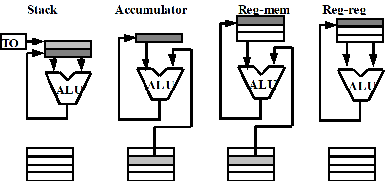
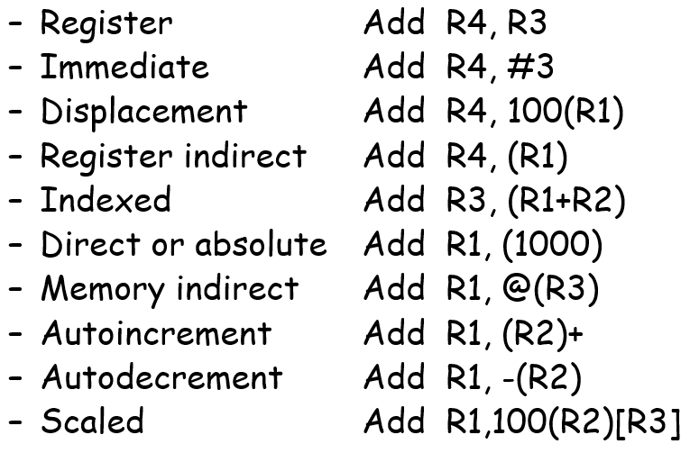
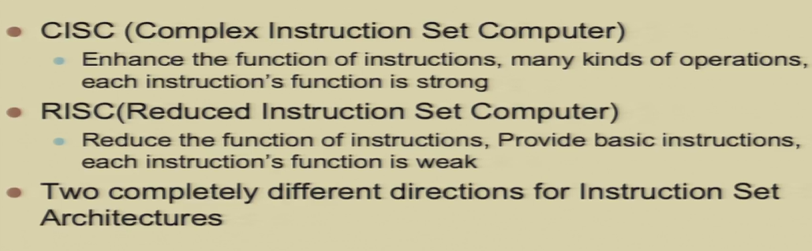
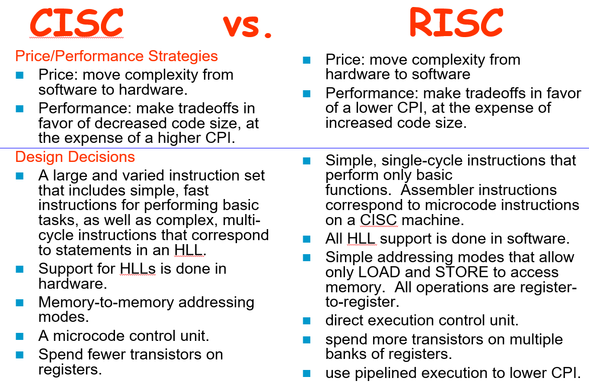

## ISA

- 根据操作数存储的方式

  - 堆栈型
  - 累加器型
  - GPR
  - 下面的是内存

  

- 地址解析和寻址

- 大端和小端

  - 小端：高字节保存在高地址（Intel）
  - 大端：高字节保存在低地址（IBM.Motorola）

- 不对齐的访问

  - 字对齐

- 寻址模式

  

  - 比较常用的寻址：偏移量寻址，立即数寻址，寄存器寻址（值在寄存器中）
  - 更细：偏移量占几位？考虑页内偏移
    - 12-16位的偏移量比较合适
  - 立即数同理

- Encoding an Instruction Set

  - 可变长（Intel 80x86）
  - 固定长（ARM, MIPS）
  - 混合的

- RISC和CISC的区别

  

  
  
- MIPS：Million Instructions Per Second