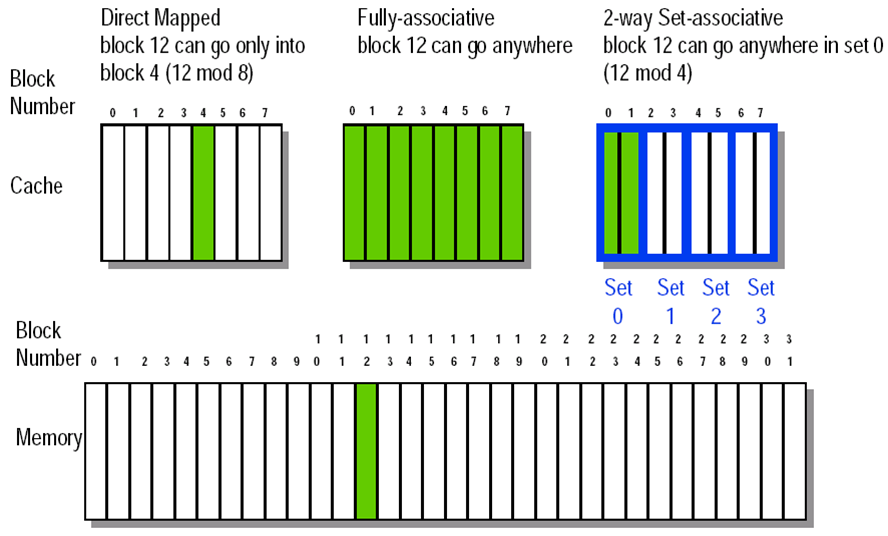
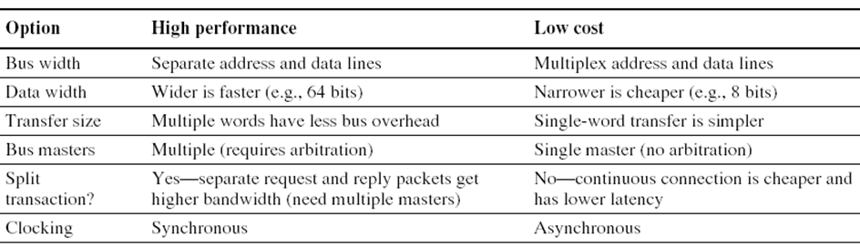

**总览**

平均存储访问时间

IC instruction count

Moore Law

Rule of Thumb

Measurements of Dependability

​	Module reliability

**CPU time**

Amdahl's Law

CPU Performance Equation

平均存储访问时间：分时启动，共享总线

直接映像

cache优化：虚地址到物理地址转换的同时进行TLB访问，virtually indexed physical tagged

**ISA**

RISC：load-store结构

CISC & RISC

**Pipeline**

写成stall stall ID更好

**Memory**

tag index block_offset

映射到哪一个set里？index一样，同一个组

snooping协议

RAID 0 1 3 4 5

奇（异或起来是1？）/偶（是0）校验

#### ch4_1

- 随机访问的memory

  - 掉电后都没有，上电之后会处在任意状态（不是全0）
  - SRAM Static Random-Access Memory
    - 通电就可以保持数据
    - 靠6个晶体管管一个比特，密度低
    - 贵，速度快
  - DRAM Dynamic
    - 需要周期性地更新（电容会慢慢放电），且速度慢些
    - 靠电容来记忆
    - 便宜，一个电容 + 一个晶体管就可以管一个比特，密度高，功耗低
  - DRAM和CPU的工艺不同，因此不能放一起
  - CPU里只能加SRAM
  - Main memory 用DRAM，CPU cache 用SRAM
  - 相同容量，SRAM更大

- 摩尔定律

  - 集成电路上可以容纳的晶体管数目在大约每经过18个月便会增加一倍。换言之，处理器的性能每隔两年翻一倍。

- Miss Penalty

  - block替换 + 把block交给处理器的时间

- AMAT

  - average memory access time

- Q1：主存的block放在cache的什么地方？

  - Direct mapped, Fully-associative, 2-way Set-associative

  

- Q2：标识cache里的数据对应主存里的哪个数据

  - 对fully-associative，12这个地址要全部写到cache里
  - 需要valid bit

  

- Q3：块替换

  - Random, LRU, FIFO

- Q4：写策略

  - write through：写cache的同时也写主存，只需要valid bit就行

    - 主存里一直有最新的数据
    - 用write buffer解决比较慢的问题

  - write back：只写cache，需要dirty bit

    - 被替换的时候miss penalty很长
    - 多核的时候，写主存的时候需要广播

  - 采用write through时，写的时候需要等待去写主存

    - 引入**write buffer**介于**CPU和主存**之间，**CPU往cache和buffer都写**
    - 内存控制器会以自己的时钟把buffer里的数据写到主存
    - buffer里的数据：一个地址 + 值
    - buffer会满，还是会stall
    - 一致性不好
    - 可以通过再加一层cache来解决

    

  - 写的时候发现是miss，写的时候block不在cache里

    - write allocate （一般与write back搭配）
      - 先把块装到cache里再说
    - write around (no write allocate) （一般与write through搭配）
      - 块就只写到主存里，并不存进cache
      - no write allocate意味着只有在read的时候才做allocate

- Split vs. unified caches

  - 单一cache：需要的硬件少，但**hit rate降低，miss rate更高**
  - Split : remove the misses due to **conflicts between inst blocks and data blocks**, but has fixed cache space for both instructions and data.

- Cache performance

  - 每条指令访问主存次数：大于1，因为取指
  - AMAT average memory access time
    - hit time + miss rate * miss penalty

#### ch4_2

- 提升cache性能

  - 降低hit time
    - 小的cache；不需要地址的翻译；way prediction；跟踪的cache
    - way prediction：预测是组里的哪个块
  - 提升cache的bandwidth
    - cache和memory之间的带宽：一次获得更多的东西，一次把整个block弄进来
  - 降低miss penalty
    - 多级cache
    - read miss prior to writes

- Miss来源于哪里？**3 Cs**

  - Compulsory
    - 冷启动的miss，第一次引用的miss
  - Capacity
    - 容量不够，需要块替换
  - Conflict
  - Coherence：cache一致性

- 假设cache大小不变

  - 块变大

    - 块数量变少，compulsory次数减少
    - 但miss penalty也会上升，因为每次要取更多的数据
    - 同时也会提升conflict misses因为cache中的块少了
    - trade-off：最小化miss rate * miss penalty，依赖于底层存储器的latency和bandwidth
    - cache越大，miss rate越小是肯定的
    - 块越大，miss rate是U型曲线

    

  - cache变大

    - 好处：减少了capacity misses
    - 坏处：hit time变长（找更花时间）

  - 关联度变大

    - 降低conflict miss
    - 2:1 rule of thumb *a direct-mapped cache of size N has the same miss rate as a 2-way set-associative cache of size N/2.* 

  - Way prediction

  - Pseudo-Associative Cache (column associative)

    

- 编译器

  - Merging Arrays

    

    - 把同一个下标的两个数组放到同一个块里

  - Loop Interchange

    

  - Loop fusion 循环融合

  - 矩阵乘法

- hardware prefetching

  - 在CPU需要使用之前就把数据从memory中取出来
  - 减少了compulsory misses
  - 

- compiler prefetching

  - 编译器插入prefetch的指令，在真正需要之前就取进来

#### ch4_3

- latency, bandwidth
- DRAM不是为速度而生，不能集成到片内，所以是片外的
- **bandwidth：每个周期送多少个字节**

- 更宽的总线

  

  

  - Amdahl's Law：部分改进，改进的部分越大越好

- Interleaved Memory

  

  - 不用等到把数据取回cache再开始下一次送地址

    

    

- 独立的memory banks

  - 不要让访问都集中到同一个bank里

- DRAM芯片

  - 同样大小的存储器，芯片越少，性能越好

- Access time

  - time between when a read is requested and when the desired word arrives

- Cycle time

  - minimum time between requests to memory
  - 两次请求之间最小的时间，让地址线稳定下来

- 

- DRAM

  - Addresses divided into 2 halves (Memory as a 2D matrix):
    RAS or *Row Access Strobe*
    CAS or *Column Access Strobe*

- 改进DRAM性能

  - Fast Page Mode DRAM FPM

    

    - 在同一page里面不再做row地址的发送，大量的访问都是连续的，高比特部分不变

  - Synchronous DRAM**（SDRAM）**

    - 原本是异步的，即地址已经准备好了，但需要一个信号来让数据读取在某个时间开始
    - synchronous DRAM指的是一次通知启动以后，就不需要再给启动信号了，它们之间约定好一个时序关系，照着这个做就好

  - DDR —— Double data rate

    - On both the rising edge and falling edge of the DRAM clock signal, DRAM innovation to increase bandwidth is to transfer data, thereby doubling the peak data rate.

------

##### Virtual memory

- page一般比block大

- cache里面存的是物理地址还是虚地址？

- 如果存的是物理地址，意味着MMU的翻译要在此之前进行

- **重要的图：**

  

#### ch5

- 同步的性能更好

- 磁盘：越往外圈，密度越小
- arbitration 总线需要仲裁
- 中断，不在总线上，需要走中断控制线

##### RAID

- MTTF：Mean time between failures

- RAID0：没有冗余

  - 数据在不同的磁盘上，磁盘越多并行度越高

- RAID1：磁盘镜像

- RAID3：bit-interleaved parity disk

  

  - 有一个盘坏掉，可以恢复
  - 读/写的时候要同时读/写四个盘
  - 就算只写一个盘，另外两个数据盘都要读，然后写P盘
  - P盘容易坏

- RAID5

  - 把校验分到不同的盘里
  - 损耗均衡

#### ch6 Multiprocessor

- Flynn Taxonomy

  

- Appearance of memory to **hardware**

  - Q1: Memory access latency uniform?
    - Shared : yes, doesn’t matter where data goes**（UMA）**
    - Distributed: no, makes a big difference**（NUMA）**

- Appearance of memory to **software**

  - Q2: Can processors communicate directly via memory?
    - Shared (shared memory): yes, communicate via load/store
    - Distributed (message passing): **no, communicate via messages**

- 

  - **SMP：symmetric multi-processing**，一般使用UMA的方式
  - DSM：distributed shared memory

- 

- 消息传递机制

  

- Shared Memory vs. Message Passing

  - 对于shared Memory
    - 用lw/sw就可以互相访问数据
    - 通信会比较复杂
    - 编程模型比较简单
    - 需要同步，**需要更复杂的硬件**
  - 对于Message Passing
    - 硬件简单，通信更精确，编程复杂，性能差
    - 读写的时候，一定要通过对方的CPU

- 

- 绕过cache的IO操作

  

- 一致性：任何的读都需要返回最新的写

- 解决cache一致性

  - 共享的数据不放cache（软件优化：volatile不能放入寄存器）
  - 软件在关键的时候做flash的过程
  - 硬件方法：
    - Snooping Solution
      - 所有数据的请求都广播给所有处理器，如果在cache就做同步
      - write back：可能需要告知去哪拿最新的数据
    - Directory-Based Schemes
      - 有一个中央的地方
      - 广播的范围比较有效
  - Basic Snoopy Protocols
    - Write Invalidate Protocol
      - 只需要把数据置成失效即可
    - Write Broadcast Protocol
      - 还需要更新所有的copy

  

  

#### 计算

- 

- MTTF：经过这么长时间就故障

- 系统的MTTF：把所有部件的FIT加起来，而后取倒数

  

- MIPS：每秒跑多少百万条指令

- 

- 

  

- 上面的不合理

#### 存储习题课

- 

  - C是错的，block size大小要一样大（cache和memory）

- 

  - A

- 

  - A

- 

  - D（就讲了0，1，3，5）
  - 3永远用最右边的做parity
  - 5是把parity交错放在所有盘里

- 

  - B

- IPC：instruction per cycle

- **temporal 时间的**

- 

  - 50%，43ns
  - CPI：1+25%\*43\*1.1

- 

  - 错，变成一半
  - 对，conflict会减少
  - 错，block的数量增加了

- 

  - index没有过MMU翻译，但其实是physical的

- 

  - 
  - 注意有四个比较
  - 如果index不够，还需要等MMU过来拼出index

  

  

